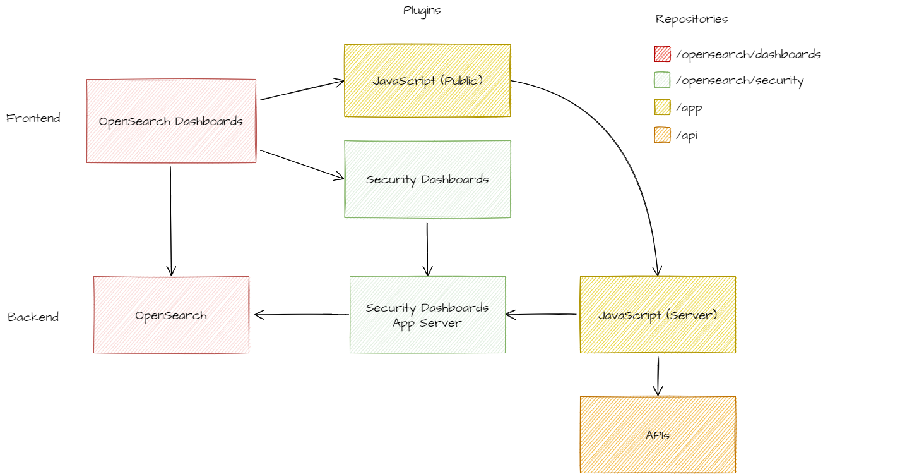

## Context
It is about when we need to develop a plugin for the Open Search app (we call it OSD, which is an open source version of Kibana + Elasticsearch).
And, in this article we have some instructions how to deal with the plugin environment, to be able to start this development.

OpenSearch Dashboards is primarily a Node.js web application built using React.
To effectively contribute you should be familiar with HTML, SASS styling, TypeScript and JavaScript, and React (take a look at [JavaScript Code Style](../../Code-Style/JavaScript.md)).

## Repositories
1. OpenSearch Dashboards: https://github.com/opensearch-project/OpenSearch-Dashboards
2. OpenSearch Dashboards Security Plugin: https://github.com/opensearch-project/security-dashboards-plugin
3. Plugin: https://xpto.com/xpto/osd-plugin
4. API: https://xpto.com/xpto
5. Dev CLI: https://xpto.com/xpto

```bash
$ git clone git@github.com:opensearch-project/OpenSearch-Dashboards.git
$ git clone https://xpto.com/xpto/osd-plugin OpenSearch-Dashboards/plugins/osd-plugin
```

## Dependencies


### Base Stack
As shown above, our base stack is OpenSearch and OpenSearch Dashboards, witch are equivalent for ElasticSearch and Kibana, respectively.

* We run the [OpenSearch server in containers](https://opensearch.org/downloads.html), orchestrated by a Docker Compose file that is configured inside the OpenSearch Dashboard project.
* The OpenSearch Dashboards (it's a fork of Elasticsearch, maintained by AWS) has dependency on our custom plugins and can be started by following some simple steps described on it’s `CONTRIBUTING_PROPRIETARY` file.

### Plugins
It’s important to notice that the OpenSearch Dashboard plugins are "full-stack" plugins, since they can have a frontend and backend, inside the `/public` and `/server` sub-folders respectively.

* The plugin is our main frontend application, and it’s setup is described on the `README.md` file.
It depends on the OSD Security plugin on the backend, for getting user information, before we forward the requests to our APIs.
* The Security Dashboards plugin is used to provide authentication and authorization for the application.

### APIs
Our main backend service, that provides all the functionality for our app.
The project runs in containers managed by Docker Compose that loads an API, database and queue services.

### Dev CLI
We use this project to build our development stack and populate our APIs.

## Getting started guide

This guide is for any developer who wants a running local development environment where you can make, see, and test changes. It's opinionated to get you running as quickly and easily as possible, but it's not the only way to set up a development environment.

### Key technologies

### Bootstrap OpenSearch Dashboards

If you haven't already, change directories to your cloned repository directory:

```bash
$ cd OpenSearch-Dashboards
```

The `yarn osd bootstrap` command will install the project's dependencies and build all internal packages and plugins. Bootstrapping is necessary any time you need to update packages, plugins, or dependencies, and it's recommended to run it anytime you sync with the latest upstream changes.

```bash
$ yarn osd bootstrap
```

Note: If you experience a network timeout while bootstrapping:

```
| There appears to be trouble with your network connection. Retrying...
```

You can run command with —network-timeout flag:

```
$ yarn osd bootstrap —network-timeout 1000000
```

Or use the timeout by configuring it in the [`.yarnrc`](https://github.com/opensearch-project/OpenSearch-Dashboards/blob/main/.yarnrc). For example:

```
network-timeout 1000000
```

If you've previously bootstrapped the project and need to start fresh, first run:

```bash
$ yarn osd clean
```

### Run OSD Plugin

Start the OpenSearch Dashboards development server:

```bash
$ yarn start
```

When the server is up and ready (the console messages will look something like this),

```
[info][listening] Server running at http://localhost:5603/pgt
[info][server][OpenSearchDashboards][http] http server running at http://localhost:5603/pgt
```

Click on the link displayed in your terminal to  access it.

Note - it may take a couple of minutes to generate all the necessary bundles. If the Dashboards link is not yet accessible, wait for a log message like

```
[success][@osd/optimizer] 28 bundles compiled successfully after 145.9 sec, watching for changes
```

Note: If you run a docker image, an error may occur:

```
Error: max virtual memory areas vm.max_map_count [65530] is too low, increase to at least [262144]
```

This error is because there is not enough memory so more memory must be allowed to be used:

```
$ sudo sysctl -w vm.max_map_count=262144
```

For windows:

```
$ wsl -d docker-desktop
$ sysctl -w vm.max_map_count=262144
```
