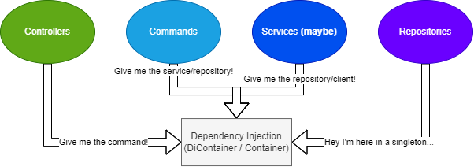

## Concepts

### Rule Types
1. **Domain rules (enterprise rules):** define internal business rules of our application, which do not depend on (and don’t change with) external services.
2. **Application rules:** are domain rules that establish how the application should behave based on the state of the domain entity. In other words, they are the behaviors of the application based on the domain state.
3. **Adapters rules:** are all kinds of conversion and adaptation of external APIs, databases, etc., to our domain entity classes.

### Principal Actors
1. **Entities:** the core of the business. In these classes, there are many rules related to the actors of the system. The rules handle What are the objects modeled and what is their behavior.
2. **Controllers:** view (client browser) links with other parts of the system: that is, it receives requests from the view and passes them on to be processed by business and application rules.
3. **Commands:** business rule. That is, the rules of the feature and logic to be applied.
4. **Services:** application rule. That is, parsers, conversions, etc.
5. **Repositories:** database access. In other words, it abstracts all database connection commands, so that if the technology is changed, it is not necessary to change other files/classes, only the repository.

## Concepts Applied
The three examples below, are the file structure of a module or of a small application (less than 10k lines).

The ideal scenario, is when you have a very simple application with 3 layers. So, mixing the knowledge with a bit of practice, you'll have:
```
|__ domain                (contracts)
  |__ commands              only one exception that doesn't have contract and it's implementation
  |__ entities
  |__ repositories
|__ infrastructure        (implementations)
  |__ repositories          (orm) begin with tool prefix and return models from the database or the external tool
```

But sometimes, the things get complicated, and you need more layers to handle the applications rules, framework isolation and so on.
```
|__ domain                (contracts)
  |__ commands              only one exception that doesn't have contract and it's implementation
  |__ entities
  |__ repositories          it's a contract to be used by the service
  |__ services              it's a cotract to be used by the command
|__ infrastructure        (implementations)
  |__ repositories          (orm) begin with tool prefix and return models from the database or the external tool
  |__ services              starts with tool prefix and parse the database return to an entity
```

And it can be fully complicated when you have the API layers in the middle, having each proper parsing/mapping.
```
|__ domain                (contracts)
  |__ commands              only one exception that doesn't have contract and it's implementation
  |__ entities
  |__ repositories          it's a contract to be used by the service
  |__ services              it's a cotract to be used by the command
|__ infrastructure        (implementations)
  |__ controllers
    |__ requests
    |__ responses
    |__ mappers
  |__ repositories          (orm) begin with tool prefix and return models from the database or the external tool
  |__ services              starts with tool prefix and parse the database return to an entity
    |__ mappers
```

## Flows Explained
When you are developing some applications, there are some questions about how to develop, place the files and so on.

### Requests Flow
This is the structure to make it easier understand how the request coming from the browser pass through an application (API or anything related).


### Mapping/Parsing Flow
This is the structure related to how to isolate the layers between each other, with the intention to avoid hard coupling between frameworks or external tools.


### Dependency Injection Flow
This is the very simple explanation about a DI schema works and how it gets the proper information through the code.



## Testing Schema

(under development)

## References

* https://martinfowler.com/bliki/CQRS.html
* https://martinfowler.com/articles/mocksArentStubs.html
